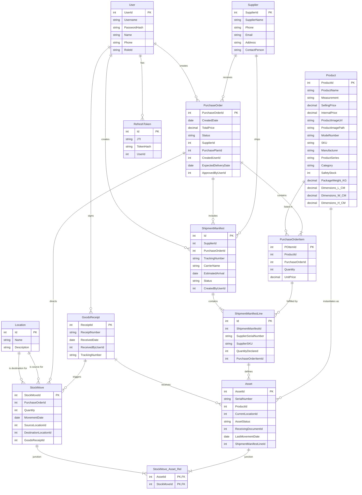
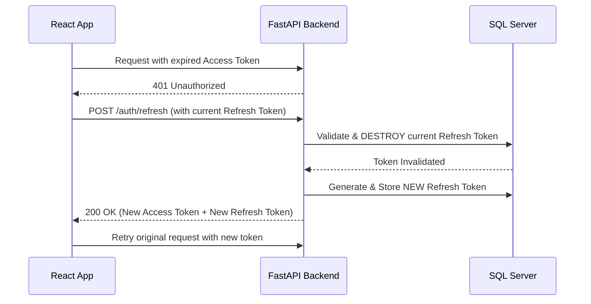
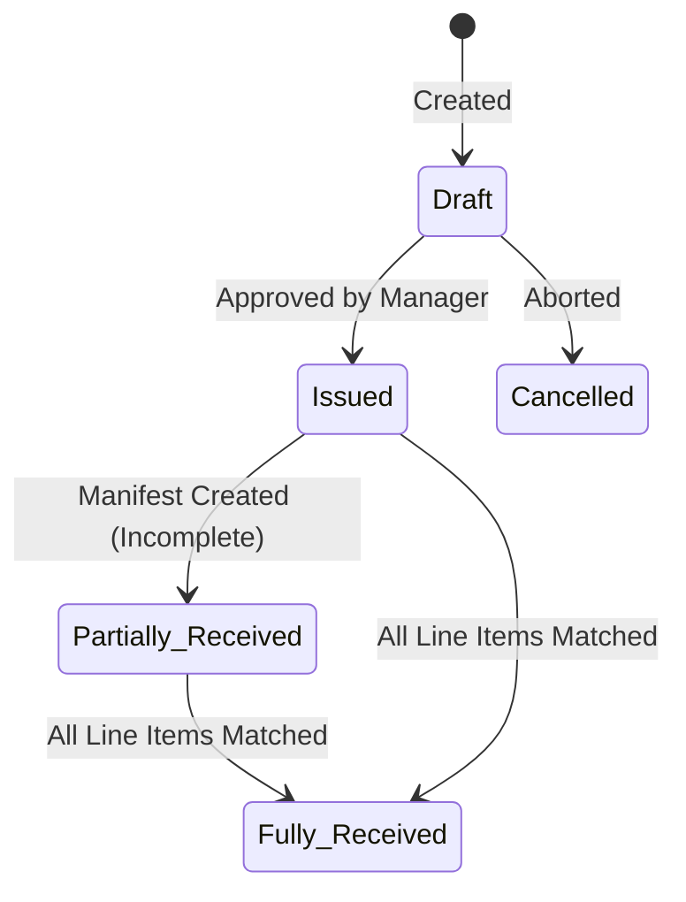
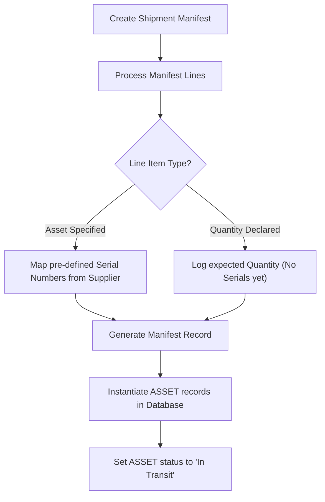
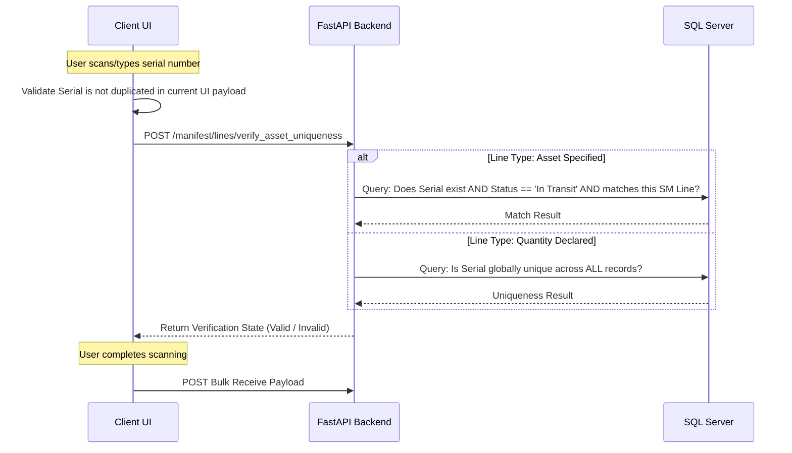

# Digital Device Inventory Management System

A production-ready, full-stack inventory platform designed to digitize hardware procurement, dock receiving, and quality control workflows. Built with React, FastAPI, and SQL Server.

## Noticeable UI Features

### (1) Master-Detail PO Items View
Simultaneous high-level metrics and granular data investigation. 

### (2) Dynamic Data Tables
Engineered for dense data environments, allowing users to toggle column visibility dynamically to reduce cognitive load.

### (3) Smart Data Entry
Relational data creation made seamless. The UI utilizes an advanced autocomplete feature to query and select product metadata instantly during procurement.

If user intent to leave the PO not create or drafted, it warns them

### (4) Create Shipment Manifest Flow: Multi-Step Form Wizard
A guided, state-retaining wizard that ensures complex receiving manifests are built accurately before submission. 
*Flow: (1) Search PO -> (2) Add Manifest Info -> (3) Success Confirmation -> (4) Create new Manifest

### (5) Dock Receiving & Bulk Verification
Optimized for warehouse operations. Users can scan, accept, or reject multiple serial numbers in the client-side UI before committing the final bulk payload to the backend.

1. Search for shipment manifest

2. Tab Lite 8: Scan 5 received assets and accept them (supplier didn't declared their serial number so you don't need to check them)

3. ProBook X1: Scan received assets and reject them

### (6) Master Data Management
Comprehensive product creation interface integrating directly with Cloudinary for immediate visual asset management and previewing.

---

## (2) Business Logic Diagrams

### (1) Entity-Relationship Diagram (ERD)
Strict relational integrity mapping the procurement lifecycle.

### (2) JWT Auto-Refresh Sequence
Strict relational integrity mapping the procurement lifecycle.
Secure, seamless session management ensuring continuous warehouse operations without sudden logouts.

### (3) PO Lifecycle State Machine
Strict state transitions preventing invalid procurement actions.

### (4) Shipment Manifest Creation Flow
Backend validation ensuring physical shipments do not exceed requested procurement totals.

### (5) Asset Verification Flow in Dock Receiving
Decoupled client-side scanning and state management to minimize database transaction locks until final commit.

